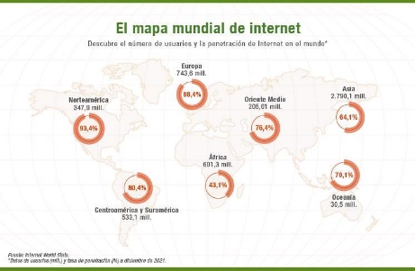
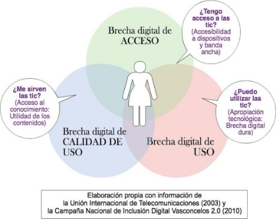
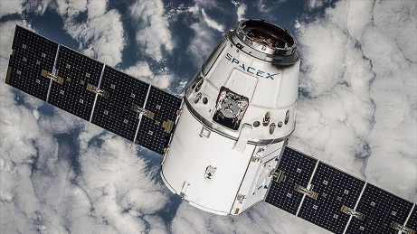
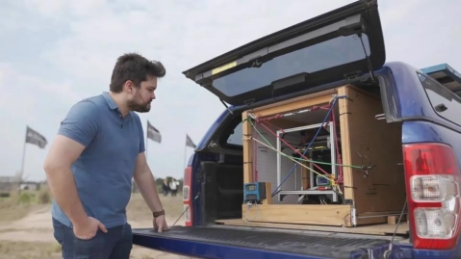

# Stella
Repository where i upload all my college assigments of  TYHM subject

**Sociedades 5G** 

**Un análisis de la tecnología en nuestra sociedad actual** 

Juan Ignacio Luna Casabene 

Facultad de Ingeniería, Universidad Nacional de Cuyo e-mail:[ juanicei99@gmail.com ](mailto:juanicei99@gmail.com)

**Abstract.**  

El propósito de este artículo es hacer un análisis a detalle sobre la situación que nuestra sociedad está atravesando el día de hoy, relacionada con el ámbito tecno- lógico tanto a nivel nacional, como a nivel internacional. 

La idea central es el impresionante avance tecnológico que ha superado con cre- ces cualquier estadística a lo largo de los últimos años, y como estas tecnologías siguen sin poder superar una barrera fundamental, llegar a los sectores más vul- nerables de nuestra sociedad. 

**Keywords.** Tecnología, Sociedad, Actualidad 

**1  Introducción** 

Muchos somos los que a día de hoy, de la mano de nuestra carrera, Ingeniería Me- catrónica, quedamos impresionados con cada nuevo dispositivo que entra al Mercado, cada nuevo software, procesador, componente, etc, ¿y cómo no hacerlo? Es impresio- nante las maravillas que puede lograr la mente humana cuando se lo propone, y el rubro de las nuevas tecnologías no se queda atrás.  

Desde avances en la biomedicina con nuevos nanomateriales y materiales inteligen- tes, hasta interfaces de Inteligencia Artificial en las que es difícil dilucidar si uno está hablando con un ser humano o una máquina, debido a su complejidad y naturalidad a la hora de dar los resultados. Simplemente con estas consideraciones es difícil imaginar un límite para la tecnología y la ciencia, al menos en un futuro cercano. 

Sin embargo, hay algo que ni la mente más brillante ha podido solucionar hoy en día, y es como hacer que estas nuevas tecnologías lleguen a los sectores más vulnerables de nuestra sociedad. 

**2  La brecha digital** 

La desigualdad en el acceso a Internet y las TIC se conoce como brecha digital . Para algunas personas el pedir un turno al médico, hacer compras por internet o almacenar un documento en la nube forma parte de su vida cotidiana, es algo inherente a su estilo de vida, tanto porque tiene la posibilidad de acceder a los medios para lograr dicho cometido, como el hecho de la continua influencia de su entorno para desarrollar un ambiente propicio para que dichas aptitudes en el manejo de las tecnologías se desarro- llen naturalmente. Para otras personas, por lo contrario, esto supone una utopía por no disponer ni de los dispositivos necesarios ni de las competencias básicas para hacerlo. 

Es fenómeno puede ser observado en distintos ámbitos: a nivel generacional, entre países, entre alumnos que asisten a la misma institución, etc. 

**Fig. 1.** Fuente: Internet World Stats

Observando la Fig. 1 se puede apreciar claramente la desigualdad incluso de un con- tinente entero respecto a los demás. Este continente es África, claro está, con un por- centaje de población con acceso a internet del 43,1%, frente a Norteamérica con un 93,4% o incluso Latinoamérica, con un 80,4%. 

Mediante estas estadísticas podemos comenzar a inferir que la brecha tecnológica (al menos uno de los tipos, esto se aclarará a continuación) va acompañada de una clara desigualdad de condiciones entre ambas regiones. 

Lo cierto es que no existe una única brecha digital y, por el contrario, hay muchas clases propiciadas por diversas causas. A continuación, presentaremos los principales tipos de brecha digital. 

**2.1  Tipos de brecha digital** 

**Fig. 2.** Fuente: Shorthand Social

1. **La brecha de acceso** 

Este tipo de brecha digital hace referencia a la imposibilidad que tienen algunos gru- pos de acceder a las TIC. Si bien las causas son diversas, suelen estar relacionadas por las diferencias socioeconómicas que existen entre grupos de población o entre países. 

Una de las principales causas de este tipo de brecha, así como observamos anterior- mente en la Fig. 1, es el hecho de que no todos los países pueden invertir la cantidad necesaria de dinero público para crear infraestructuras que permitan el acceso al internet** o que, en un plano más individual, no todas las personas tienen el nivel económico suficiente para comprar dispositivos electrónicos o pagar el acceso a la nube. Además de la falta de ingresos, la brecha de acceso hace frente a ciertas limitaciones, como la edad avanzada y el bajo nivel de estudio. 

2. **La brecha de uso** 

Esta es la brecha que provoca la carencia de habilidades digitales. La falta de forma- ción impide a muchas personas usar las TIC a nivel personal o profesional. 

Sin duda, esto supone consecuencias como la imposibilidad de acceder a puestos de trabajo más cualificados o que una buena parte de la población esté al margen de ciertos servicios, como concertar citas médicas o hacer trámites administrativos, que mejoran la calidad de vida de las personas que los usan. 

3. **La brecha generacional** 

La tecnología afecta a todos los aspectos de nuestra vida, pero hay un grupo de po- blación, la más envejecida, que ha llegado algo más tarde al cambio y, por tanto, no ha recibido ningún tipo de formación en competencias digitales. Esto es un poco lo que se dijo anteriormente, dado que la gente de edad más avanzada no fue criada en un entorno en donde se lo estimuló e incentivó a utilizar dispositivos electrónicos o de otra índole a temprana edad, y todo el conocimiento y manejo de las nuevas tecnologías que po- drían tener no se desarrollaría de forma nativa, si no por lo contrario, de una forma sumamente forzada y mecánica, apelando a la memoria más que a la intuición. 

Esta es una brecha que se acrecenta todavía más si a este factor de la edad unimos las desigualdades económicas y geográficas. 

Asimismo, es importante mencionar las dificultades de acceso y formación que tie- nen las personas con alguna discapacidad, ya que, a la falta de infraestructuras, de di- nero y de formación, hay que sumarle, la carencia de dispositivos o sitios web adaptados a las personas con algún tipo de necesidad especial. 

En vista a estas distintas formas de encarar el problema de la brecha digital, nos damos cuenta que es un fenómeno multivariable, y como todo problema de ese tipo, es sumamente difícil de resolver, al menos de manera plena. 

**3  La paradoja del progreso** 

**Fig. 3.** Fuente: maquinasyavancestecnicos.wordpress.com

Es innegable que el avance desmedido en el ámbito científico y tecnológico es algo que impresiona. Hace tan solo 54 años, en 1969,  el hombre fue capaz de llegar a la Luna; hoy por hoy se habla de habitar marte. 

En ese entonces, la computadora utilizada para el control de la nave espacial era el Apollo Guidance Computer (AGC), que fue desarrollado por la empresa MIT Instru- mentation Laboratory y construido por la empresa Raytheon, con una memoria de nú- cleo magnético de 2K (2048 palabras de 15 bits cada una) y una memoria de solo lectura (ROM) de 36K. Un teléfono inteligente típico de hoy en día suele tener entre 4 GB y 12 GB de memoria RAM, lo que equivale a aproximadamente 2 a 6 millones de veces más memoria que la AGC. Además, la memoria de almacenamiento en un teléfono inteligente moderno suele estar en el rango de 64 GB a 512 GB, lo que equivale a 32 a 256 millones de veces más memoria que la AGC. Toda la potencia de un sistema de cómputo inalcanzable y sofisticado para la época, al alcance de una mano en el bolsillo. 

En su mayor virtud, la tecnología presenta su más grande paradoja: 

Se ha vuelto una herramienta indispensable a la hora de resolver problemas de lo más complejos, pero aún así pareciera que hay problemáticas de lo más esenciales que aún no ha sabido o no ha podido resolver. 

¿Cómo es posible que frente a un progreso avasallante como el ejemplo expresado anteriormente aún haya en el mundo una inmensa cantidad de personas sin posibilida- des de acceder a las necesidades más básicas y fundamentales a las que cualquier ser humano debería poder acceder? 

La cuestión es que, y por esto nos referimos a una gran paradoja, pareciera que aún con el exponencial crecimiento de las TICs, el acceso a la información, el avance tec- nológico general, la población y la sociedad no pareciera seguir ese rumbo, si no más bien una involución del progreso, que se ve manifestado en la educación, en la cultura, en la creciente pobreza y la enorme desigualdad, la cual pareciera que dichos avances acrecentan. 

¿Es acaso el progreso tecnológico un motor del desarrollo humano, o es realmente una razón más por la que la brecha de desigualdad crece día a día? 

**4  Conectividad global** 

**Fig. 4.** Fuente: https://www.freeimages.com/

Sin embargo, no todo es negativo, si bien gran parte de la población no puede acceder al último modelo de teléfono, o las últimas gafas de realidad virtual, son pocos los in- dividuos que no tienen en su poder un teléfono celular con acceso a internet. 

Esto garantiza que dichos usuarios, cualquiera sea su condición económica o gene- racional, tengan la herramienta necesaria para dicha comunicación. 

El problema de esto no reside en el dispositivo en sí, si no en la posibilidad de cone- xión a una red de internet. En los últimos años esto ha sido parcialmente solucionado, mediante la creación por parte de gobiernos de espacios públicos de acceso, como lo son plazas, parques o espacios comunes.  

Más recientemente, incluso se ha logrado solucionar este problema en las comuni- dades rurales, donde no había infraestructura para hacer llegar la conexión a estos lu- gares, dejando a estos grandes grupos de gente sin conexión alguna. Mediante un pro- yecto conocido como Starlink, llevado adelante por la empresa SpaceX, se ha podido ofrecer un servicio de alta velocidad y baja latencia a través de todo el mundo (limitado a ciertos países por el momento), esto es posible gracias a la constelación más grande de satélites que operan en una órbita baja alrededor de la Tierra. De esta manera me- diante una antena diseñada para que cualquier persona pueda instalarla, controlada me- diante una aplicación podemos tener acceso a internet desde cualquier parte del mundo. Además, esta antena es portable, de manera que puede llevarse a cualquier lado, conec- tarla a una fuente de corriente y configurarla con la aplicación. 

**Fig. 5.** Fuente: https://www.aa.com.tr/

Superada la brecha digital de acceso por factores infraestructurales, queda la brecha de acceso relacionada a lo económico, ya que lógicamente este es un servicio que ofrece una empresa privada, lo cual puede ser solventado por una inversión estatal que permita a la gente que no tiene los recursos actuales para solventar el gasto, tener acceso a dicho servicio, con el objetivo que dicho servicio pueda nivelar la igualdad de oportunidades y darle la capacidad a esta persona de posteriormente, en un futuro no muy lejano, poder solventar el pago del servicio por su cuenta. 

**5  La tecnología al servicio de la comunidad** 

Un caso de estudio de una empresa que sirva a la comunidad mediante la innovación tecnológica es el caso de una ONG conocida como “Atomic Lab”, fundada por Gino Tubaro en 2015, creada para facilitar el acceso a prótesis a miles de personas con re- cursos limitados. 

Bajo el lema “Convertimos a chicos en superhéroes”, utilizando las últimas tecnologías, esta organización busca acercar soluciones innovadoras a bajos costos. “*Nos inspira- mos en las personas con las cuales colaboramos y constantemente nos planteamos desafíos globales buscando poner al alcance diversas herramientas para cumplir di- chos objetivos, generando de esta manera nuevas oportunidades*” 

**Fig. 6.** Fuente: Atomic Lab

Las prótesis están hechas a base de PLA, un derivado del maíz, se realizan en 24 o 48 horas, dependiendo de su tamaño, y cuestan cientos de veces menos que otras op- ciones que se ofrecen en el mercado pero resultan económicamente inalcanzables para muchas familias que las necesitan. 

Por si fuera poco, a su corta edad, Gino también creó una red de “embajadores ató- micos” que se encargan de continuar esta práctica en el resto del mundo. Son colabora- dores que solo tienen que poseer una impresora 3D o acceso a ella y Atomic Lab les brinda, a través de una plataforma, las personas a las que ayudar y el archivo para rea- lizar la impresión. Así se forma una alianza que logra extender esta buena práctica glo- balmente. 

**Fig. 7.** La “Manoleta”. Fuente: Atomic Lab

Este caso es un ejemplo de como, con conocimiento y una fuerte vocación social, se pueden adaptar las nuevas tecnologías para servir a los que menos tienen y más nece- sitan. 

**6  Nuestro compromiso** 

El más grande desafío que tendremos que afrontar como futuros ingenieros meca- trónicos en pleno siglo XXI es el desarrollo de tecnologías que mejoren la calidad de vida de cada ser humano, no importa su situación o procedencia, basándose siempre en la excelencia, el desarrollo sustentable y una fuerte convicción de estar a la altura de las circunstancias frente a un mundo sumamente cambiante, a tazas cada vez más altas, y tener siempre presente que el fruto de nuestro trabajo tiene el potencial de cambiar el mundo y transformar la vida de las personas. 

**7  Referencias** 

1. CORPORATIVA, I. (n.d.). Iberdrola. Iberdrola.[ https://www.iberdrola.com/compromiso-so- cial/que-es-brecha-digital ](https://www.iberdrola.com/compromiso-social/que-es-brecha-digital)
1. La brecha digital: qué es y cómo podemos reducirla. (n.d.). La Brecha Digital: Qué Es Y Cómo Reducirla | Blog Becas Santander.[ https://www.becas-santander.com/es/blog/brecha- digital-que-es.html ](https://www.becas-santander.com/es/blog/brecha-digital-que-es.html)
1. Starlink. (n.d.). Starlink.[ https://www.starlink.com ](https://www.starlink.com/)
1. Atomic Lab - Nosotros - Transformamos chicos en super heroes. (n.d.). Atomic Lab - Noso- tros - Transformamos Chicos En Super Heroes.[ https://www.atomiclab.org/about-us.html ](https://www.atomiclab.org/about-us.html)
1. Team, B. N., & T. (2021, September 29). La historia de las prótesis que están cambiando la vida de miles de niños | TN. La Historia De Las Prótesis Que Están Cambiando La Vida De Miles De Niños | TN. https://tn.com.ar/general/2021/09/29/la-historia-de-las-protesis-que-es- tan-cambiando-la-vida-de-miles-de-ninos/ 

